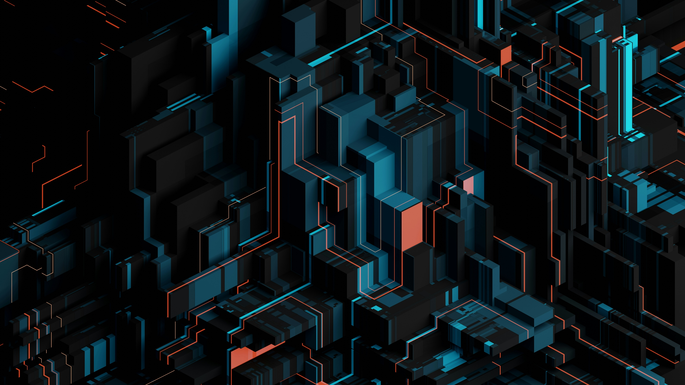

# Omarchy Tealon Theme

  
  
  

Status: development preview  
Intended Omarchy target: Quattro  
Tested installed Omarchy version: none

A dark, architectural theme inspired by the supplied `backgrounds/01-geometric-leader.jpg`: near-black voids, deep teal structures, electric cyan traces, and coral signal accents. It carries over the source theme's coordinated shell, lock, notification, launcher, GTK, Walker, terminal, editor, and application styling without copying its branded assets.

The category badge is a community label, not certification. The target is not a tested-version claim.

## Supplied reference

## Install

For local development, copy this directory to an unused `~/.config/omarchy/themes/tealon` and select it from the theme menu. Record the current theme and background first; do not overwrite a modified installed copy.

For a published Git repository, document its exact URL with `omarchy theme install`; that command can replace an existing destination.

## Rollback

Select the previously recorded theme, restore its recorded background, and restore any backed-up destination. These instructions need live verification.

## Included

- Semantic dark palette in `colors.toml`
- Shell surface tokens in `shell.toml`
- Hyprland and hyprlock styling
- GTK, Walker, mako, SwayOSD, Waybar, and preview/share-picker styling
- Terminal palettes for Alacritty, Foot, Ghostty, Kitty, and Warp
- Application/editor styling for btop, Helix, Neovim, Obsidian, Pi, Vencord, VS Code, Aether/Zed, Chromium, and icons
- The supplied geometric wallpaper, retained only as the visual reference and not duplicated as a new asset

## Validation limits

See [validation evidence](evidence/checks.tsv). Static checks are run locally; no live desktop, Git-install, image-decoding, or registry acceptance is claimed unless recorded there. The handoff checker validates file/evidence consistency, not visual quality or runtime compatibility.

## Credits

See [CREDITS.md](CREDITS.md). The supplied reference image's redistribution permission remains pending; it is not claimed as a newly bundled theme asset.
